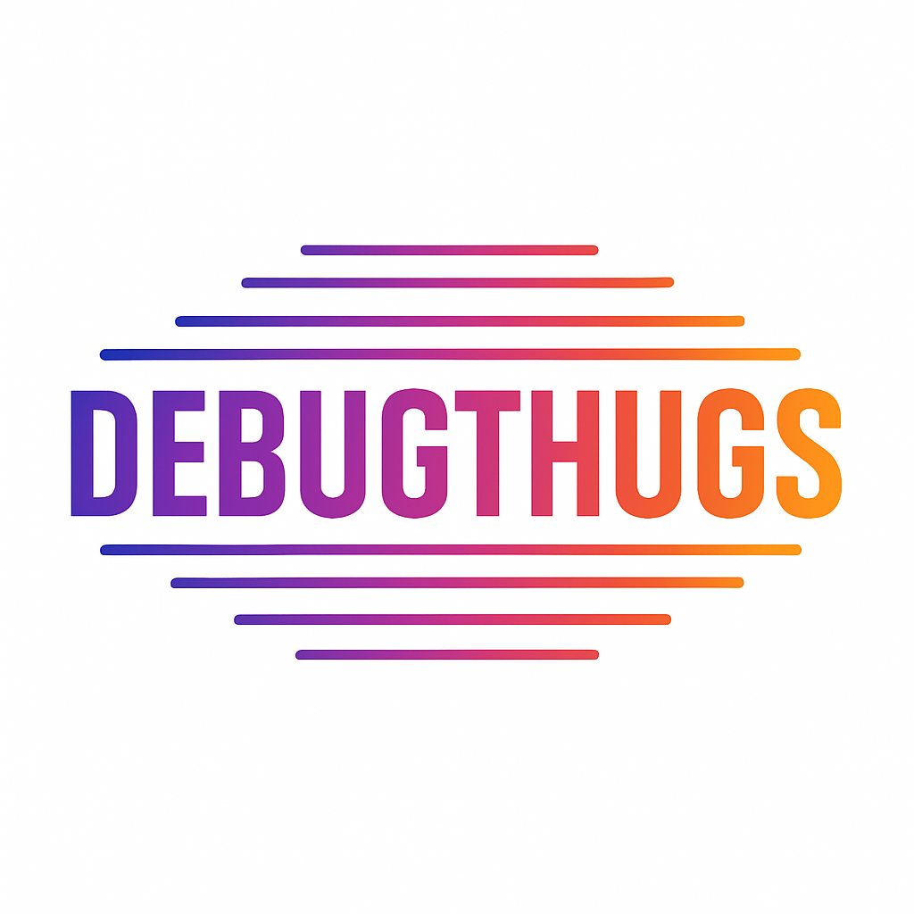

</head>
<body>

  

    <h1>Debugthugs</h1>
    
  

  <section>
    <h2>📁 About</h2>
    
Our project is focused on <strong>fire safety</strong> and is built entirely using HTML, CSS, and JavaScript. It aims to raise awareness and provide important interactive resources about fire safety for users of all ages.

  </section>

  <section>
    <h2>🖼️ Screenshots</h2>
    
  </section>

  <section>
    <h2>⚙️ Installation</h2>
    <ol>
      <li>Open a terminal on your local machine and clone the repository by the link below.</li>
      <li>Run the application and you are ready to go!</li>
    </ol>
    <code>https://github.com/debugthugs/fire-safety-site</code>
  </section>

  <section>

  
  </section>

  <section>
    <h2>💻 Technologies</h2>
 
<strong>Code editors and collaborative services used:</strong>

    

      
      
      
      
    

   
  </section>

  <section class="team">
  
  </section>

  <section class="team">
    <h2>👥 Our team</h2>
    <ul>
      <li>👨‍💻 Калоян Коев – Front-end Developer</li>
      <li>🧠 Теодор Деспотов – Back-end Developer</li>
      <li>🎨 Любомир Имелов – Designer</li>
    </ul>
  </section>

  

    ⭐ Thank you for checking out our repo! If you had a good time, leave us a star!
  

</body>
</html>
